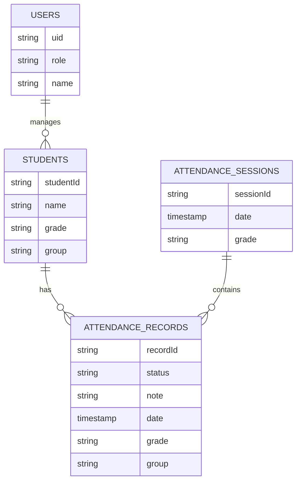
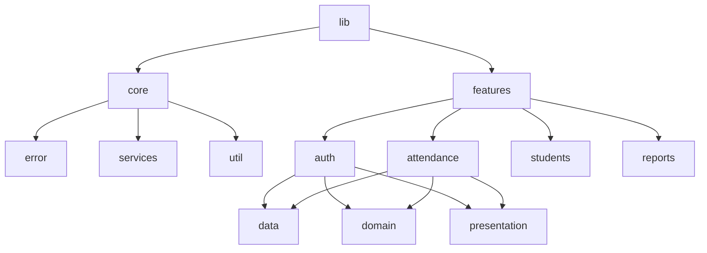

# Attendance Management System - Project Plan

## 1. Project Overview

The Attendance Management System is a robust, offline-first mobile application designed to streamline the process of recording and monitoring attendance for groups (e.g., church services, classrooms). It empowers Servants (Admins) to efficiently manage student data and attendance records while providing Students with transparency regarding their own attendance history.

### Core Functionalities & Roles

- **Servant (Admin)**:
  - **Manage Students**: Add new students to specific grades/groups.
  - **Record Attendance**: Mark students as Present or Absent, with optional notes.
  - **Reports**: View comprehensive attendance reports for their assigned groups.
  - **Offline Capability**: Perform all actions without an internet connection; data syncs automatically when online.

- **Student**:
  - **View History**: Access their own personal attendance record and statistics.

## 2. Tech Stack

- **Mobile Framework**: **Flutter** (Android & iOS)
- **Backend & Cloud Services**: **Firebase**
  - **Authentication**: Firebase Auth (Email/Password, Phone, etc.)
  - **Database**: Cloud Firestore (NoSQL)
  - **Serverless**: Firebase Functions (for complex sync logic or triggers)
- **Offline Storage**: **Hive** (Fast, lightweight NoSQL database for local caching)
- **State Management**: **BLoC** (Business Logic Component)
- **Architecture**: Feature-First Clean Architecture

## 3. Functional Requirements

### Authentication
- Users must log in to access the app.
- **Firebase Auth** handles secure authentication.
- Role-based redirection upon login (Servant vs. Student).

### Attendance Recording (Servant)
- **Session Creation**: Select a date, grade, and group to start an attendance session.
- **Marking**: List of students is displayed; Servant toggles status (Present/Absent).
- **Notes**: Optional text field for comments on specific attendance records.
- **Smart Sync**:
  - *Online*: Data is written directly to Firestore and cached locally.
  - *Offline*: Data is saved to Hive. A background job or app-resume event triggers synchronization to Firestore when connectivity is restored.

### Reporting
- **Servant View**: Summary of attendance percentages per session or per student over a date range.
- **Student View**: List of dates attended vs. missed, with a summary percentage.

## 4. Data Modeling (Firestore)

### Collections & Structure

*Updated to denormalize `date`, `grade`, and `group` into `attendanceRecords` for efficient querying.*

| Collection | Document ID | Fields | Description |
| :--- | :--- | :--- | :--- |
| **users** | `uid` | `uid` (string)<br>`role` (string: 'servant', 'student')<br>`name` (string)<br>`linkedStudentId` (string, optional)<br>`grade` (string, optional) | App users (Servants & Students) |
| **students** | `studentId` | `studentId` (string)<br>`name` (string)<br>`grade` (string)<br>`group` (string)<br>`createdBy` (uid) | Student profiles managed by Servants |
| **attendanceSessions** | `sessionId` | `sessionId` (string)<br>`date` (timestamp)<br>`grade` (string)<br>`group` (string)<br>`createdBy` (uid) | Represents a specific meeting/class event |
| **attendanceRecords** | `recordId` | `recordId` (string)<br>`sessionId` (string)<br>`studentId` (string)<br>`status` (string: 'present', 'absent')<br>`note` (string)<br>`date` (timestamp)<br>`grade` (string)<br>`group` (string)<br>`syncStatus` (string: 'synced', 'pending') | Individual attendance entries. `date`, `grade`, `group` are denormalized. |

### Example Document Data

**students/student_123**
```json
{
  "studentId": "student_123",
  "name": "John Doe",
  "grade": "Grade 5",
  "group": "Group A",
  "createdBy": "servant_uid_001"
}
```

**attendanceRecords/rec_987**
```json
{
  "recordId": "rec_987",
  "sessionId": "session_555",
  "studentId": "student_123",
  "status": "present",
  "note": "Arrived late",
  "date": "2023-10-27T09:00:00Z",
  "grade": "Grade 5",
  "group": "Group A",
  "syncStatus": "synced"
}
```

### Database Schema Diagram



## 5. Firestore Queries

To ensure performance and scalability, we define the key queries required for each screen. Denormalization of the `date`, `grade`, and `group` fields in `attendanceRecords` allows for efficient querying without complex joins.

### A. Servant: View Group Attendance
*Get all records for a specific session.*
```javascript
db.collection('attendanceRecords')
  .where('sessionId', '==', 'SESSION_ID_123')
```

### B. Servant: Student Attendance History
*Get attendance history for a specific student.*
```javascript
db.collection('attendanceRecords')
  .where('studentId', '==', 'STUDENT_ID_456')
  .orderBy('date', 'desc')
```

### C. Student: My Attendance
*Get the logged-in student's attendance history.*
```javascript
db.collection('attendanceRecords')
  .where('studentId', '==', CURRENT_USER_UID)
  .orderBy('date', 'desc')
  .limit(20)
```

### D. Servant: Weekly Report (Range Query)
*Get all attendance records for a group within a date range.*
*Note: This requires a composite index on `grade` + `date`.*
```javascript
db.collection('attendanceRecords')
  .where('grade', '==', 'Grade 5')
  .where('date', '>=', START_DATE)
  .where('date', '<=', END_DATE)
```

## 6. Security Rules

We will use Firestore Security Rules to enforce RBAC (Role-Based Access Control).

- **Servants**: Read/Write access to `students`, `attendanceSessions`, and `attendanceRecords` for groups they manage.
- **Students**: Read-only access to their own `attendanceRecords` and `students` profile.

### Example Rules

```firestore
rules_version = '2';
service cloud.firestore {
  match /databases/{database}/documents {

    // Helper function to check if user is servant
    function isServant() {
      return get(/databases/$(database)/documents/users/$(request.auth.uid)).data.role == 'servant';
    }

    match /attendanceRecords/{recordId} {
      // Student can read their own records
      allow read: if request.auth != null && resource.data.studentId == request.auth.uid;

      // Servant can read/write all records (refine scope as needed)
      allow read, write: if request.auth != null && isServant();
    }

    // ... similar rules for other collections
  }
}
```

## 7. Offline Sync Strategy

1.  **Local First Reads**: The app always tries to read from the local Hive database for instant UI rendering.
2.  **Write Strategy**:
    - Writes are committed to Hive immediately with a `syncStatus: 'pending'`.
    - A `SyncService` monitors network connectivity (using `connectivity_plus` package).
3.  **Synchronization Process**:
    - When internet is available, `SyncService` iterates through 'pending' records in Hive.
    - It pushes changes to Firestore (batch writes preferred).
    - Upon success, the local record is updated to `syncStatus: 'synced'`.
    - If conflict occurs (server has newer data), server data wins (Last Write Wins, or custom logic).

## 8. Deliverables

### A. UI/UX Screens

#### 1. Servant Dashboard
```text
+-----------------------------------+
|  [Menu]       Dashboard           |
|-----------------------------------|
|  Welcome, Servant John            |
|                                   |
|  [ Quick Stats ]                  |
|  Students: 25   Last Week: 80%    |
|                                   |
|  [ ACTION CARD ]                  |
|  +-----------------------------+  |
|  |       TAKE ATTENDANCE       |  |
|  +-----------------------------+  |
|                                   |
|  [ RECENT SESSIONS ]              |
|  - 10/25/2023: Grade 5 (Done)     |
|  - 10/18/2023: Grade 5 (Done)     |
|                                   |
+-----------------------------------+
```

#### 2. Attendance Sheet
```text
+-----------------------------------+
|  < Back      Oct 27, 2023         |
|-----------------------------------|
|  Grade 5 - Group A                |
|                                   |
|  [ Search Student...            ] |
|                                   |
|  [ ] Select All                   |
|                                   |
|  1. John Doe             [P] [A]  |
|     Note: __________________      |
|                                   |
|  2. Jane Smith           [P] [A]  |
|                                   |
|  3. Alex Johnson         [P] [A]  |
|                                   |
|  [ SUBMIT ATTENDANCE ]            |
+-----------------------------------+
```

#### 3. Student Dashboard
```text
+-----------------------------------+
|  [Menu]      My History           |
|-----------------------------------|
|  Hello, Alex                      |
|                                   |
|  Attendance Rate: 92%             |
|                                   |
|  HISTORY                          |
|  ------------------------------   |
|  Oct 27, 2023        PRESENT      |
|  Oct 20, 2023        PRESENT      |
|  Oct 13, 2023        ABSENT       |
|                                   |
+-----------------------------------+
```

### B. Folder Structure (Flutter)



### C. BLoC Definition
- **AuthBloc**: `LoginRequested`, `LogoutRequested`, `CheckAuthStatus`.
- **AttendanceBloc**: `LoadSession`, `MarkAttendance`, `SubmitSession`, `SyncOfflineData`.
- **StudentBloc**: `LoadStudents`, `AddStudent`, `UpdateStudent`.

### D. Testing Plan
- **Unit Tests**: Test logic in BLoCs, Repositories (mocking Firestore/Hive), and UseCases.
- **Widget Tests**: Verify UI elements (Buttons, Lists) render correctly.
- **Integration Tests**: Test the full flow of "Login -> Add Student -> Take Attendance -> Sync".

## 9. User Journey Flowchart

```mermaid
flowchart TD
    Start[Open App] --> CheckAuth{Logged In?}
    CheckAuth -- No --> LoginScreen[Login Screen]
    LoginScreen -->|Success| FetchRole{Get Role}

    CheckAuth -- Yes --> FetchRole

    FetchRole -- Servant --> ServantDash[Servant Dashboard]
    FetchRole -- Student --> StudentDash[Student Dashboard]

    ServantDash --> TakeAtt[Take Attendance]
    TakeAtt --> SelectDetails[Select Date/Group]
    SelectDetails --> StudentList[List Students]
    StudentList --> MarkStatus[Mark Present/Absent]
    MarkStatus --> Save{Internet?}

    Save -- Yes --> WriteFirestore[Write to Firestore]
    Save -- No --> WriteHive[Write to Hive (Pending)]

    WriteFirestore --> Success
    WriteHive --> Success

    StudentDash --> ViewStats[View Stats]
```

## 10. Final Checklist

- [ ] Firebase Project Setup (Auth, Firestore enabled).
- [ ] Flutter Project Initialized with dependencies (firebase_core, cloud_firestore, hive, flutter_bloc).
- [ ] Authentication Flow implemented & tested.
- [ ] Hive Local Database configured for offline persistence.
- [ ] SyncService implemented to handle offline->online transitions.
- [ ] CRUD operations for Students (Servant only).
- [ ] Attendance Recording UI & Logic.
- [ ] Reporting Screens implemented.
- [ ] Security Rules deployed to Firestore.
- [ ] Unit & Integration Tests passed.
